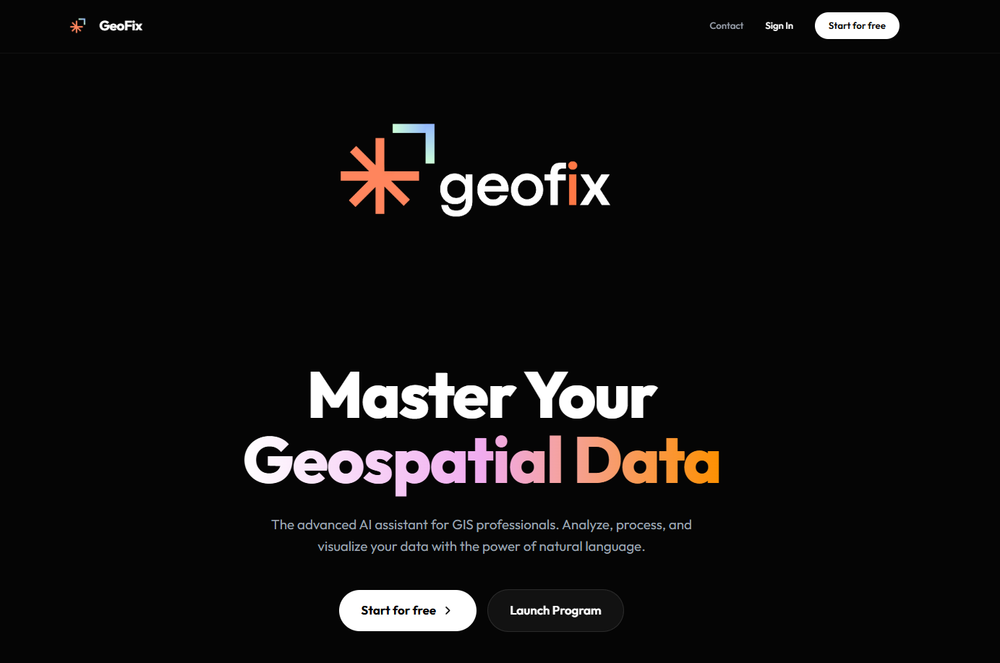

# GeoFix 2.1 — AI-Powered Geospatial Data Correction

<p align="center">
  
</p>

[](https://github.com/AmmarYasser455/GeoFix/actions/workflows/ci.yml)
[](https://python.org)
[](LICENSE)

**GeoFix** is an autonomous AI agent that detects and fixes errors in geospatial data (Shapefiles, GeoJSON, GeoPackage). It runs **100% locally** using Ollama and Chainlit, providing a secure and free alternative to cloud-based solutions.

## Demo



## Features

- **One-Liner API** — `geofix.analyze("data.shp")` for instant quality assessment
- **CLI** — `geofix analyze data.shp --auto-fix` from the command line
- **Local AI Intelligence** — Powered by Llama 3.2 / 3.1 / DeepSeek R1 via Ollama
- **Automated QC Pipeline** — Detects topology errors (overlaps, gaps, slivers, road conflicts)
- **Intelligent Model Routing** — Auto-selects the optimal model based on query complexity
- **Conversational Interface** — Chat with your data naturally ("Fix these errors", "Explain the logic")
- **Response Caching** — Instant responses for common queries
- **Conversation History** — Persistent SQLite-backed conversation storage with search
- **Three-Tier Decision Engine** — Rules → LLM → Human review with full audit trail
- **Modern UI** — Glassmorphism dark theme with smooth animations
- **93 Tests** — Comprehensive test suite with CI

## Architecture

```
geofix/
├── api.py             # One-liner API (analyze, validate, fix)
├── cli.py             # Click-based CLI
├── core/              # Config, models, cache, router
├── chat/              # Chainlit app, LangChain agent, tools
├── decision/          # Three-tier engine (rules, LLM, human review)
├── fixes/             # Geometry correction operations
├── audit/             # SQLite audit database and logger
├── storage/           # Conversation persistence
├── integration/       # OVC and GeoQA bridges
├── knowledge/         # GIS encyclopedia
├── validation/        # Data validation
└── utils/             # Shared utilities
```

## Quick Start

### Prerequisites

1. **Python 3.10+**
2. **[Ollama](https://ollama.com)** installed and running
3. Pull at least the fast model:
   ```bash
   ollama pull llama3.2
   ```

### Installation

```bash
git clone https://github.com/AmmarYasser455/GeoFix.git
cd GeoFix
pip install -e .
```

### Python API

```python
import geofix

# Analyse a dataset
result = geofix.analyze("buildings.shp")
print(result.summary())

# Auto-fix and save
geofix.fix("buildings.shp", "corrected.gpkg")
```

### CLI

```bash
geofix analyze data.shp                              # quality report
geofix analyze data.shp --auto-fix -o fixed.gpkg     # fix & save
geofix chat                                           # launch AI assistant
```

### Chat Interface

```bash
geofix chat
```

Open **http://localhost:8080** in your browser.

### Configuration

Copy `.env.example` to `.env` to use Google Gemini instead of Ollama:
```env
GOOGLE_API_KEY=your-key-here
```

## How It Works

1. **Upload** a geospatial file (SHP / GeoJSON / GPKG)
2. **Profile** — GeoFix analyzes data quality (CRS, validity, duplicates)
3. **Detect** — The OVC pipeline identifies spatial errors
4. **Decide** — The three-tier engine selects the best fix strategy:
   - **Tier 1** (Rules): Deterministic fixes for clear-cut cases
   - **Tier 2** (LLM): AI reasoning for ambiguous situations
   - **Tier 3** (Human): Escalation for low-confidence cases
5. **Fix** — Corrections are applied with full audit logging
6. **Export** — Download the corrected dataset

## Development

```bash
pip install -e ".[dev]"
pytest tests/ -v --cov=geofix
ruff check geofix/ tests/
```

## License

MIT License. Built by **Ammar Yasser Abdalazim**.
